<br />
<p align="center">
  <a href="https://github.com/effectspcbs/vscode-spinasm">
    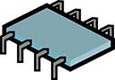
  </a>

  <h3 align="center">VSCode-SpinASM</h3>

  <p align="center">
    A set of tools to work with the Spinsemi FV-1 chip from VSCode.
    <br />
    <a href="https://github.com/effectspcbs/vscode-spinasm/tree/master/software">VSCode module</a>
    ·
    <a href="https://github.com/effectspcbs/vscode-spinasm/tree/master/hardware">Programmer</a>
    ·
    <a href="https://github.com/effectspcbs/vscode-spinasm/tree/master/firmware/spinasm">Programmer's firmware</a>
    ·
    <a href="https://github.com/effectspcbs/vscode-spinasm/tree/master/assembly">Assembly resources</a>
  </p>
</p>
<br />

---

### Table of content

- [About](#about)
- [Building a programmer](#building-a-programmer)
    - [From a PCB](#from-a-pcb)
        - [Board build](#board-build)
        - [FTDI chip setup](#ftdi-chip-setup)
        - [Firmware upload](#firmware-upload)
    - [From an Arduino board](#from-an-arduino-board)
        - [Board setup](#board-setup)
          - [Arduino Uno]()
          - [Arduino Pro Mini]()
        - [Firmware upload](#firmware-upload)
    - [Programmer wiring](#programmer-wiring)
- [Using the VSCode module](#using-the-vscode-module)
    - [Installation](#installation)
      - [Prerequisites](#prerequisites)
    - [Usage](#usage)
      - [Projects](#projects)
      - [Settings](#settings)
    - [Commands](#commands)
- [Links](#links)

---

## About

The project aims to provide a cross-platform replacement for the SpinAsm software in the form of a module for the Microsoft VSCode editor. The cross-compilation part is done by the alternate [asfv1](https://github.com/ndf-zz/asfv1) assembler, the compiled programs are then sent to an in-circuit EEPROM by either an ATMEL AVR based programmer or a simple Arduino board.

To get started, all you need is to install the module and build a programmer.

---

## Building a programmer

### From a PCB

A quick note about the current version of the PCB : there are some tight tolerances around the ICSP header mounting holes used to fix the SOIC clamp. Check your manufacturer's capabilities as you need a 0.25mm tolerance from non-plated thru hole to track. I've used JLCPCB's services to build it with no issues.

#### Board build

You can find the current gerber files [here](https://github.com/effectspcbs/vscode-spinasm/tree/master/assembly/Gerbers), there are two versions available :

* Panel

A 150x100mm panel with mounting holes meant to be built using a stencil and this [support tool](https://github.com/effectspcbs/Parts/blob/master/Stencil%20support/support_2.STL).

<p align="center">
  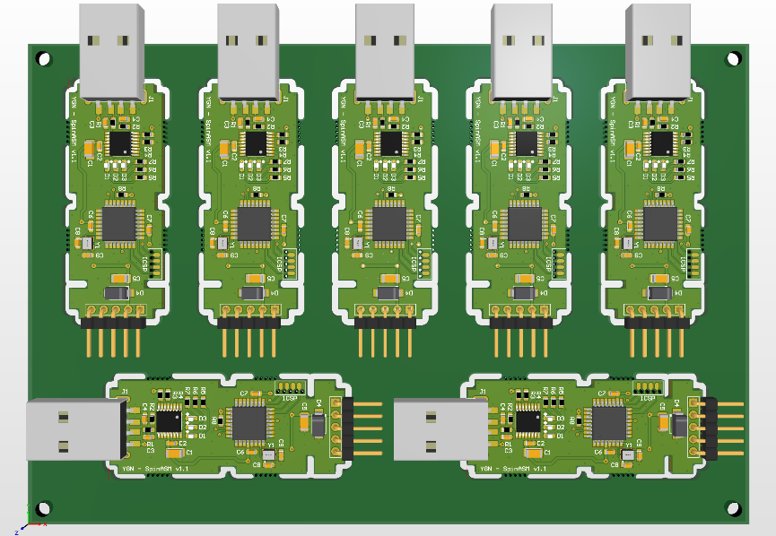
</p>

* Single

A single board to hand solder.

<p align="center">
  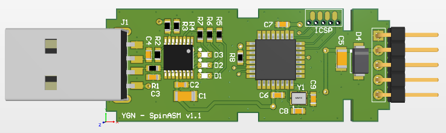
</p>

It is a very simple circuit that is basically a slimmed-down arduino board composed of a FTDI USB to UART chip and an AVR microcontroller, you can find the BOM [here](https://github.com/effectspcbs/vscode-spinasm/blob/master/assembly/BOM/BOM.xlsx).


#### FTDI chip setup

The board is powered by the target circuit so you need to set the correct CBUS bits for the *VBUS_SENSE* pin and the RX/TX LEDs if you choose to include them in your build. This is done using the FT_PROG utility from FTDI. it's pretty straightforward to use: power the board, connect it to a computer via USB and set the correct bits.

<p align="center">
  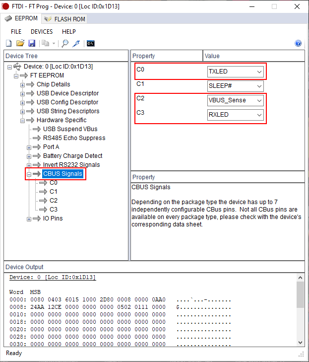
</p>

#### Firmware upload

The PCB uses the [SOICbite](https://github.com/SimonMerrett/SOICbite) footprint as an ICSP header, the pinout on the board is as follows:

<p align="center">
  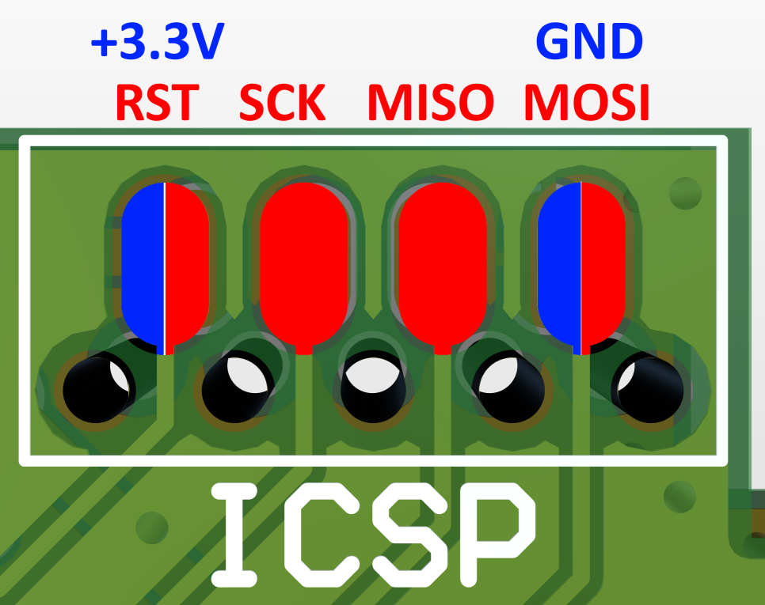
</p>

Which out of my SOIC clamp translates to :

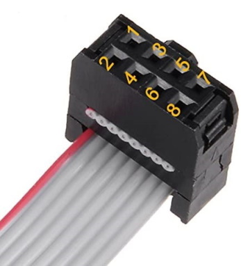

Pin | ICSP pin
--- | --- 
1 | RST
2 | +3.3V
3 | SCK
4 | *NC*
5 | MISO
6 | *NC*
7 | MOSI
8 | GND

<br />
<br />

The project uses VSCode and the PlatformIO module as a development environment, the repository is setup to upload the firmware via a generic AVRISP MKII programmer and target an ATMEGA328PB running at 12Mhz from an external crystal :

```ini
[env:ATmega328P]
platform = atmelavr
board = ATmega328PB
framework = arduino
board_build.mcu = ATmega328PB
board_build.f_cpu = 12000000L
board_hardware.oscillator = external
board_upload.speed = 57600
upload_protocol = stk500v2
upload_flags = -Pusb
```
The next step is to set the fuse bits :

`platformio run --target fuses`

And finally upload the firmware :

`platformio run --target program`


### From an Arduino board

As there are many flavors of Arduino boards i will use two examples : the extremely common Arduino Uno that we probably all have laying around and what i suppose would the ideal board for that purpose, the Arduino Pro Mini running at 3.3V.


#### Board setup


#### Arduino Uno

The Arduino Uno is not the ideal candidate for that very specific purpose as in most incarnation it will run off a 5V power supply while the target EEPROM will run at 3.3V. But it has to be the most common Arduino board out there so why not use it, all that is needed to make it talk the EEPROM are simple level shifters. They are available as pre-made boards but are really simple circuits :

<p align="center">
  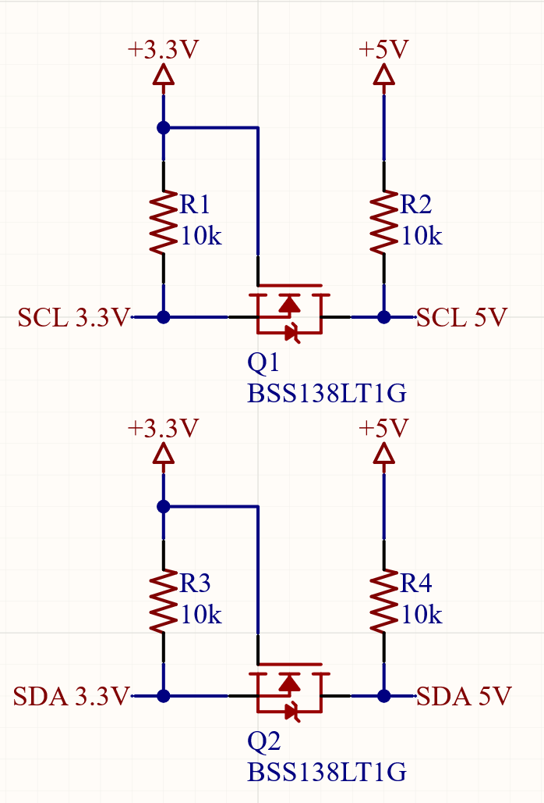
</p>

Then the following pins are used to program the target circuit :

<p align="center">
  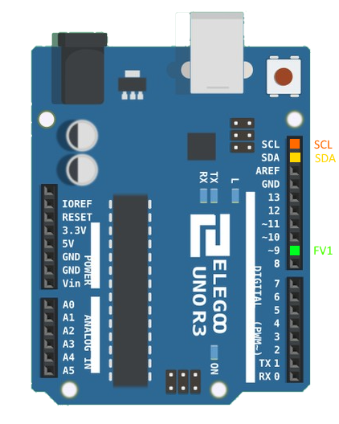
</p>

#### Arduino Pro Mini

The Arduino Pro Mini is pretty much what's inside the custom programmer minus the FTDI chip but any USB to UART adapter will do as long as it can work at 3.3V. It is recommended to power the Arduino board from the target circuit using the following pinout:

<p align="center">
  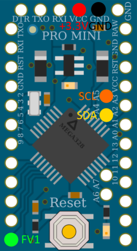
</p>

#### Firmware upload

The code requires a change in the base Arduino I2C library as the default buffer size is limited to 30 bytes, simply change the following value in the `twi.h` file:

```cpp
#define TWI_BUFFER_LENGTH 34
```

After that, simply setup the platformio.ini file as follows, for the Uno :

```ini
[env:uno]
platform = atmelavr
framework = arduino
board = uno
```

Pro Mini :

```ini
[env:pro8MHzatmega328]
platform = atmelavr
framework = arduino
board = pro8MHzatmega328
```

And upload the firmware :

`platformio.exe run --target upload`

### Programmer wiring

The target circuit should look like this and expose the following pins via some kind of header:

<p align="center">
  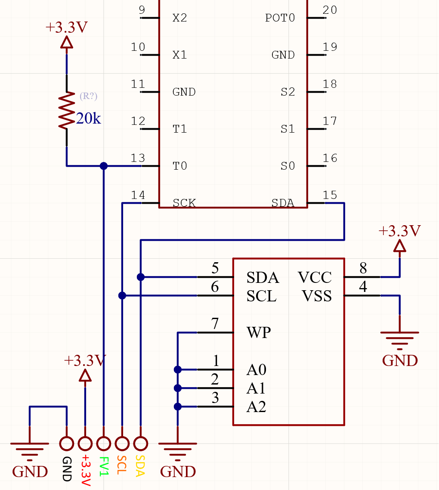
</p>

---

## Using the VSCode module

### Installation

As of right now the module is only available as a standalone installer, you will find it at the root of the <a href="https://github.com/effectspcbs/vscode-spinasm/tree/master/software">source code</a> folder.

#### Prerequisites

The module depends on the asfv1 compiler, it is avaialble on the Python Package Index. You can find the installation instrutions on the [project's GitHub](https://github.com/ndf-zz/asfv1#system-specific-installation).

### Usage

#### Projects

The module follows the same logic as the SpinAsm IDE and is centered around a project of 8 banks and programs:

<p align="center">
  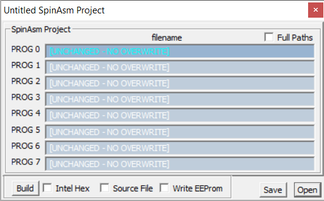
</p>

The first thing you should do is to create a blank project by opening an empty folder and using the Create project structure command:

<p align="center">
  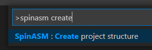
</p>

A blank project structure will look like this:

```bash
project/
├── bank_0/
│   ├── 0_programName.spn
├── bank_1/
│   ├── 1_programName.spn
├── bank_2/
│   ├── 2_programName.spn
├── bank_3/
│   ├── 3_programName.spn
├── bank_4/
│   ├── 4_programName.spn
├── bank_5/
│   ├── 5_programName.spn
├── bank_6/
│   ├── 6_programName.spn
├── bank_7/
│   ├── 7_programName.spn
├── output/
├── settings.ini
```

The folder should not be renamed but the *programName* part of the file can be changed.

#### Settings

The settings.ini file holds a few parameters you need to adjust to tell the module where the compiler is located and the programmer's path and baud rate. The default file is as follow :

```ini
;Project config file

[asfv1]
;Path of the executable
path = C:\\path\\to\\asfv1.exe

;Compiler options separated by a space :
; -c 	clamp out of range values without error
; -s 	read literals 2,1 as float (SpinASM compatibility)
; -q 	suppress warnings
options = -s

[serial]
;Serial port for the programmer
port = COM6
baudrate = 57600
```

The settings.ini file is read every time a project is compiled or uploaded.

---

## Links